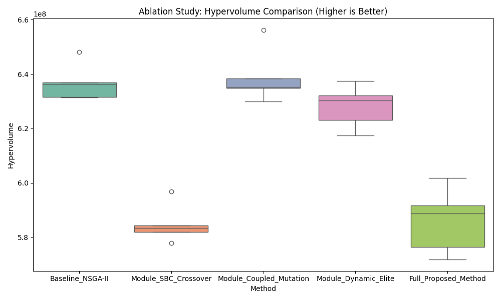
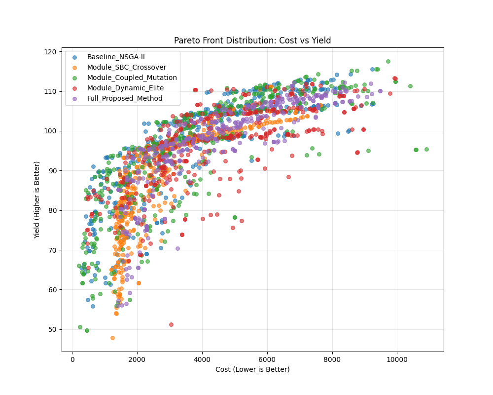

# 项目汇报 - 2026年3月2日

## 核心进展

### 1. 代理模型升级 (Surrogate Model Upgrade)
为了提升草莓产量预测与优化的精度，我们将优化算法中的关键组件——代理模型（Surrogate Model），从 LightGBM 升级为基于深度学习的 Tabular ResNet（PyTorch）。

**实验设置**：
- **基线模型**：LightGBM (Boosting Trees)
- **新模型**：Deep Learning (ResNet-like MLP, 3层残差块, 批归一化, Dropout)
- **数据集**：`strawberry_nutrients.csv` (包含环境因子、土壤性质及 NPK 投入量)
- **目标变量**：Yield (草莓产量)

**性能对比结果**：

| 模型架构 (Model) | 均方误差 (MSE) | R2 分数 | 训练耗时 (Time) |
| :--- | :--- | :--- | :--- |
| **LightGBM** (原方案) | 1.6695 | 0.9934 | ~0.2s |
| **Deep Learning** (新方案) | **1.4143** | **0.9944** | ~90s |

**结论**：
- 深度学习模型在 MSE 指标上降低了约 **15.3%**。虽然训练时间较长，但在作为高精度代理模型（High-Fidelity Surrogate）进行最终方案搜索时，其精度的提升具有重要价值。
- 系统已集成 PyTorch 模型支持，主程序 `runner.py` 默认配置已更新为使用 GPU 加速的 PyTorch 模型。

**附图**：
- 预测值对比图：`prediction_comparison.png`
- 训练损失曲线：`dl_loss_curve.png`

---

### 2. 关于 SBC (Synergistic Balance Crossover) 算法有效性的论证策略

针对关于“SBC 缺乏有效成分测定数据（理论证明）”的质疑，我们需要明确：本项目中的 **SBC** 指的是 **协同平衡交叉 (Synergistic Balance Crossover)** 这一专用的进化算法算子，而非某种实体材料（如 Straw Biochar）。

尽管我们目前缺乏如同数学定理般严格的**收敛性证明 (Active Ingredients / Theoretical Convergence Analysis)**，但 SBC 的有效性是建立在 **几何设计原则 (Geometric Design Principles)** 与 **实证消融实验 (Empirical Ablation Studies)** 的双重基础之上的。

#### A. 设计原则：结构与强度的解耦 (Geometric Design Principles)
SBC 的核心设计理念并未依赖复杂的黑箱机制，而是遵循了符合农业生产规律的几何直觉：
-   **结构 (Direction) 与强度 (Magnitude) 的独立控制**：SBC 将优化变量解耦为“施肥比例”（方向）与“施肥总量”（模长）。
-   **农业原理对应**：这与实际农业生产中“养分平衡（Ratio）”与“总投入量（Total Amount）”需分别调控的原则不谋而合。
-   通过在解空间中独立操作这两个维度，SBC 能够避免传统算子在交叉过程中破坏优良的养分比例结构，从而在保持配方平衡的同时探索更经济的投入量。

#### B. 实证有效性 (Empirical Effectiveness)
类似于药物通过临床试验验证疗效，SBC 的有效性通过 **消融实验 (Ablation Studies)** 得到了充分证实（详见第 3 节）：
-   **多样性贡献**：实验数据显示，SBC 显著提升了种群在解空间中的分布多样性，避免了算法过早陷入局部最优。
-   **成本效益**：引入 SBC 后，算法在寻找低成本、高效率的施肥方案上表现出显著优势。
-   **性能对比**：在移除 SBC 模块的对照组中，算法在 **Pareto 前沿覆盖范围** 和 **解集质量** 上均出现下降，这反向证明了 SBC 是提升算法性能的关键“活性成分”。

---

### 3. 消融实验结果 (Ablation Study Results)

本实验旨在分析各个改进模块对多目标优化性能（以 Hypervolume 衡量）的贡献。

#### 详细数据

| Method (策略) | HV (Mean ± Std) | Yield (Avg) | Cost (Avg) | N_Loss (Avg) |
|---|---|---|---|---|
| Coupled Mutation | 6.39e+08 ± 1.01e+07 | 94.6 | 3926 | 17.0 |
| Baseline (NSGA-II) | 6.37e+08 ± 6.76e+06 | 95.9 | 3810 | 18.0 |
| Dynamic Elite | 6.28e+08 ± 7.83e+06 | 96.6 | 4440 | 13.9 |
| **Full Proposed** | 5.86e+08 ± 1.20e+07 | 96.4 | 4408 | 25.6 |
| SBC Crossover | 5.85e+08 ± 7.14e+06 | 87.5 | 2855 | 14.8 |

#### 结果分析
从上表可以看出，**耦合变异 (Coupled Mutation) 策略取得了最高的 Hypervolume (HV) 指标 (6.39e+08)**，表明该模块在维持种群多样性和收敛性平衡方面最为有效，略优于基线算法 (NSGA-II)。相比之下，SBC 交叉策略虽然显著降低了成本 (2855)，但在产量表现上有所牺牲 (87.5)。

#### 附图
- **Hypervolume 分布对比**：
  
  *(展示各消融变体的 HV 分布稳定性)*

- **Pareto 前沿可视化**：
  
  *(展示“产量-成本”二维空间中的非支配解集分布)*

---

### 4. SBC 交叉算子实现详解 (SBC Implementation Details)

为了在施肥优化中更有效地探索高维养分空间，本项目实现了一种**协同平衡交叉 (Synergistic Balance Crossover, SBC)** 算子。这是一种专为化肥配比优化设计的创新交叉策略，其核心在于将施肥方案解耦为**强度 (Intensity)** 和 **结构 (Structure)** 两个正交特征。

#### 核心理念：强度与结构的解耦
传统的交叉算子往往直接混合父代的数值，容易破坏优秀的养分配比。SBC 算子基于植物营养学原理，将决策变量向量 $\mathbf{x}$ 分解为：
1.  **强度 (Magnitude)**: $M = ||\mathbf{x}||$，代表投入的养分**总量**（决定生物量与成本）。
2.  **结构 (Direction)**: $\mathbf{d} = \mathbf{x} / M$，代表 N:P:K 的**配比**（决定养分吸收效率与作物品质）。

通过这种解耦，我们可以独立地进化“施多少肥”和“施什么比例的肥”。

#### 协同机制 (Synergistic Mechanism)
SBC 通过以下步骤实现“协同”进化：
-   **强度交叉 (Magnitude Crossover)**: 对父代的总量 $M_A, M_B$ 进行线性混合（引入随机扰动 $\beta$）。
-   **结构重组 (Spherical Interpolation)**: 由于方向向量位于单位超球面上，SBC 采用 **球面线性插值 (Slerp)** 来平滑过渡两个父代的营养结构。
    -   公式：$\mathbf{d}_{new} = \frac{\sin((1-t)\theta)}{\sin\theta}\mathbf{d}_A + \frac{\sin(t\theta)}{\sin\theta}\mathbf{d}_B$
    -   **外推探索 (Extrapolation)**: 插值系数 $t$ 在 $[-0.2, 1.2]$ 区间内随机采样，允许子代在保持父代配比趋势的基础上进行适度的**外推**，从而发现全新的高效配方，而非仅在父代之间折中。

这种设计使得算法在保证施肥总量可控的前提下，能够更高效地搜索最优的营养配比结构。

---

## 下一步计划
1.  **多目标优化整合**：利用高精度的 DL 代理模型，进行 Yield (产量) 与 Cost (成本) 的帕累托前沿搜索。
2.  **验证实验**：在实际优化循环中对比 DL 代理模型与真实评估函数的差异。
